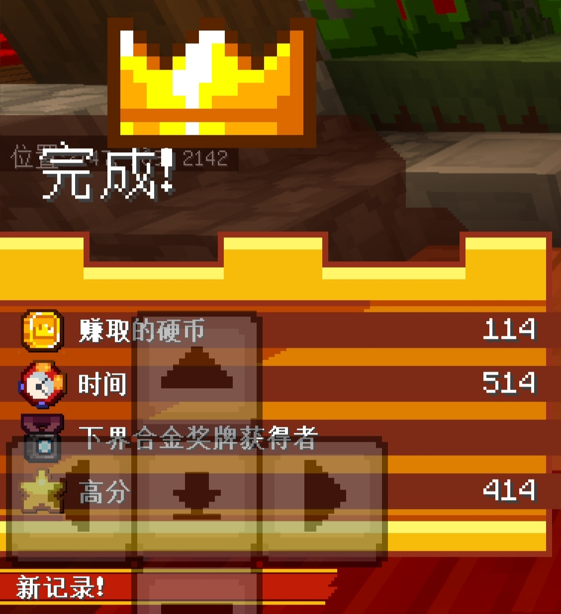
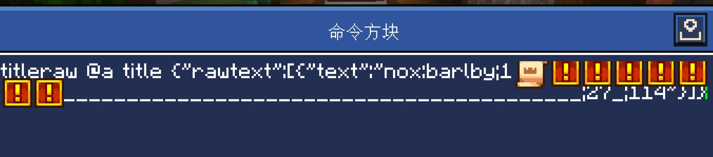

## MCC x Minecraft 15周年服务器 UI规则

* 需要使用`title`或`titleraw`指令显示

* `nox:`或`§znox`等开头的以下简称“控制文本”

---

### 完成

点击展开

**位置：`actionbar`**

* 显示
> §znox:complete
>
> **用于显示“完成”UI**(一切的基础)

* 新纪录
> nox:new_record
>
> **在“完成”UI上添加“新纪录”项**

* 类型
> nox:type_ar 王牌竞速
>
> nox:type_gr 网格跑者
>
> nox:type_md 熔毁
>
> nox:type_sot 时之沙

#### 附加项

* 奖牌（王牌竞速）
> nox:ar_trophy_1 下界合金
>
> nox:ar_trophy_2 钻石
>
> nox:ar_trophy_3 黄金
>
> nox:ar_trophy_4 铁
>
> nox:ar_trophy_5 铜

* 幸存的房间（熔毁）
  * 数字对应逃脱的房间数
> nox:md_rooms_1
>
> nox:md_rooms_2
>
> nox:md_rooms_3
>
> nox:md_rooms_4
>
> nox:md_rooms_5
>
> nox:md_rooms_6
>
> nox:md_rooms_7

* 时之沙
>nox:sot_escaped 成功逃脱
>
>nox:sot_failed 没有成功逃脱

#### 添加数据
* 数据最多15位，'§zd%d'占4位(%d为第几个数据)
> 完整数据='§z'+'d%d'+需要的数据
>
> ps:完整数据不足位数请用 '~' 在末尾补全
>
> 某些栏位用控制文本显示后，后面栏位显示内容仍使用字符数量判断
>
> 所以需要给被控制文本代替的栏位也写上空数据
>
> 把需要的内容拼在一起显示（中间可加空格也可不加，加空格更便于修改）

* 

    
示例

    * §znox:complete
    * nox:new_record
    * nox:type_ar
    * §znox:ar_trophy_1
    * §zd1114\~\~\~\~\~\~\~\~
    * §zd2514\~\~\~\~\~\~\~\~
    * §zd3\~\~\~\~\~\~\~\~\~\~\~
    * §zd4414\~\~\~\~\~\~\~\~

     
    
  

---

### 角色

点击展开

**位置：`actionbar`**

*这两个角色分别就是两个Mojang工作人员*

*你发现传送门时弹出来和你说话的*

> §znox:mojang_entry_jens 召唤jens
>
> §znox:mojang_entry_agnes 召唤agnes
>
> §znox:mojang_exit_jens 移出jens
>
> §znox:mojang_exit_agnes 移出agnes

---

### 顶部状态栏

点击展开

**位置：`title`**

> nox:barlby;1________________________________________________;2谜题;金币数
>
> nox:barace;1________________________________________________;2谜题;金币数
>
> nox:barmlt;1________________________________________________;2谜题;金币数
>
> nox:barsot;1________________________________________________;2谜题;金币数
>
> nox:bargrd;1________________________________________________;2谜题;金币数
>
>>分别对应：
>>
>>正常
>>
>>王牌竞速、融毁、时之沙、网格跑者（游戏中）
>>
>> 1后面填数据（最多48位）
>>
>> 2后面填已解开的谜题数量（最多2位）
>>
>> 游戏外谜题还需在1后添加特殊符号
>>
>> 金币数量无位数限制
>>
>>ps:不足位数请在对应数据后面用 _ 补全

  
示例

    
     
    
  

---

补充

> 经过测试，使用tellraw向玩家发送包含“§v§z”的消息会显示在准心上(当然不同设备可能不同)
>
> ui文件中，titleraw显示title包含"§v§z"或"§n§o§x"会显示为类似actionbar的样式，但是测试发现只包含"§n§o§x"会保存黑色大标题文本所示，但只包含"§v§z"或同时包含"§v§z"和"§n§o§x"可以正常显示
>
> 显示actionbar时，如果以数字开头或空格开头，就会弹出所有actionbar可以弹出的控件(只显示空白也会)，但是不已数字开头或空格开头，就是正常actionbar
>> 1.这些内容仅在我曾经测试时设备上就行过测试，不保证所有设备都是如此
>>
>> 2.地图、商店之类的需要使用scriptApi弹窗设置标题实现（如：§m§a§p），不在讨论范围内
>>
>> 3.当初对着UI盯、删MCC资源包寻找UI规律用了很长时间

> 由 [JuX](https://space.bilibili.com/600189104) 整理
>
> 2024年7月31日(文本文件格式)
>
> 2025年7月21日(markdown格式)

